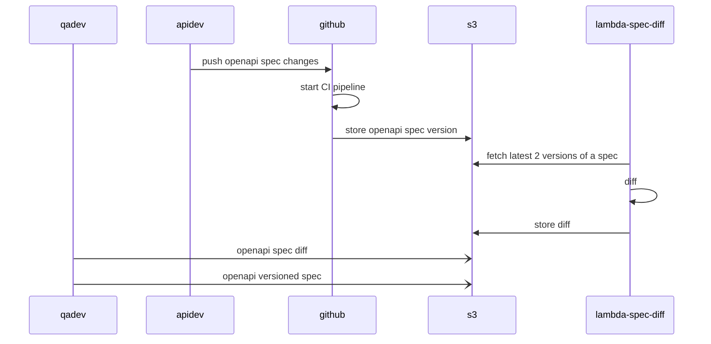

# oapi-diff

> Track openapi spec changes with ease.

> **Disclaimer**: this is just a proof of concept, don't mind the ugly. 
### Tools

- [Swagger UI](https://swagger.io/tools/swagger-ui/)
- [Swagger Diff 0](https://github.com/Sayi/swagger-diff)
- [Swagger Diff 1](https://github.com/OpenAPITools/openapi-diff)
- [Swagger Diff 2](https://bitbucket.org/atlassian/openapi-diff/src/master/)
